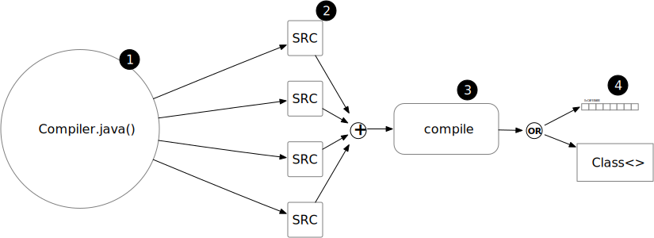
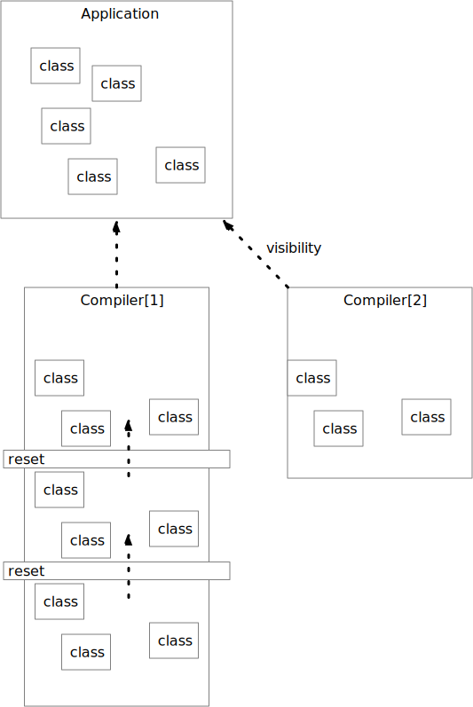

= SourceBuddy

== Introduction

You can compile Java source code you created dynamically in your Java application.
Your code can create the source code of one or more Java classes, pass the strings to SourceBuddy and use the classes.

[source,java]
----
String source = """
        package com.sb.demo;

        public class MyClass implements Talker{
            @Override
            public void say() {
                System.out.println("Hello, Buddy!");
          }
        }""";
Class<?> myClassClass = Compiler.compile(source);
Talker myClass = (Talker) myClassClass.getConstructor().newInstance();
myClass.say();

----

SourceBuddy is a simple Java source compiler facade in front of the JDK-provided `javac` compiler.
I designed it for applications creating Java source code on the fly during run-time.
The JDK API is complex and hard to use.
You can compile Java code using only the JDK, but using SourceBuddy, it is nider.
Using SourceBuddy, you do not need to implement anything except your application logic.

You

. get a `Compiler` object calling the `Compiler.java()`, and from there, all you need is
. specify the source code either as Java strings or files,
. call `compile()`
. fetch the compiled `.class` files as `byte[]`, save to file or the load the classes.
. use the class and instances (not on the picture).

[source,java]
----
Talker myClass = Compiler.java().from(source).compile().load().newInstance(Talker.class);
myClass.say();

----

There is

* a simple API with one call for simple cases compiling one class only, and

* a still simple, but more versatile fluent API for cases being a bit more complex.

In this document, we will explain the details of how to use the library, including

* Maven coordinates,

* simple API,

* Fluent API,

* Handling Hidden Classes

* support.

== Maven Coordinates

The library is available from Maven central.
The Maven central coordinates are:

[source,xml]
----
<dependency>
    <groupId>com.javax0.sourcebuddy</groupId>
    <artifactId>SourceBuddy</artifactId>
    <version>1.0.1-SNAPSHOT</version>
</dependency>
----

SourceBuddy requires Java 17.

== Simple API

You can use the simple API in projects requiring only one source file in a compilation unit.
To do that, the class `com.javax0.sourcebuddy.Compiler` defines a static method `compile().
Here is the line from the example displayed in the introduction using this method:

[soure,java]
----
Class<?> myClassClass = Compiler.compile(source);

----

The method's parameter is the string source code of the class.

The method's return value is the class compiled and loaded into the JVM.

If there is an error during the compilation, the call will throw a `CompileException` with the error message in the exception message.

== Fluent API

The fluent API is available when there are more files to be compiled or when you want to do something other than simply loading with the class files.

To demonstrate the use of the API, we will use the sample code:

[source,java]
----
 1. String sourceFirstClass = """
 2.         package com.sb.demo;
 3. 
 4.         public class FirstClass {
 5.             public String a() {
 6.                 return "x";
 7.           }
 8.         }""";
 9. final var compiled = Compiler.java()
10.         .from("com.sb.demo.FirstClass", sourceFirstClass)
11.         .from(Paths.get("src/test/java"))
12.         .compile();
13. compiled.saveTo(Paths.get("./target/generated_classes"));
14. compiled.stream().forEach(bc -> System.out.println(Compiler.getBinaryName(bc)));
15. final var loaded = compiled.load();
16. Class<?> firstClassClass = loaded.get("com.sb.demo.FirstClass");
17. Object firstClassInstance = loaded.newInstance("com.sb.demo.FirstClass");
18. loaded.stream().forEach(klass -> System.out.println(klass.getSimpleName()));
19. final var compiler = loaded.reset();
20. final var sameCompiler = compiled.reset();

----

In the following sections we wil go through the lines of the code.

=== 1.  Get the compiler object

To start the compilation, you must have a `Compiler` object.
To get that, you have to call the

[source,java]
----
        final var compiled = Compiler.java()

----

=== 2.  Add sources

The next step is to add the source files to the compiler object.
To do that, you can specify the sources one by one as strings, or you can add directories where the source files are.
The overloaded method `from()` is used for both operations.

To add sources individually, you can call

[source,java]
----
                .from("com.sb.demo.FirstClass", sourceFirstClass)

----

The first argument is the binary name of the class.
The second is the actual source code.
To add multiple sources, you can call this method one after the other multiple times.
However, if the sources are in the file system in a directory, you can also call

[source,java]
----
                .from(Paths.get("src/test/java"))

----

In this call, you specify only one parameter, a path pointing to the source root.
It is the directory where the directory structure matching the Java package structure starts.
You can have many calls to this method if you have multiple source trees on the disk.
You can also add some of the sources as strings, individually and others scanned from the file system.

=== 3.  Compile

After the program loaded the sources, the next thing is to compile:

[source,java]
----
                .compile();

----

The compilation generates the bytes codes for the Java source files.
They are not loaded as Java classes into the memory yet.

=== 4.  Save the byte codes

The next step you can do is save the byte codes.
It is not a must.
You can ignore this step if you do not need the compiled byte codes in the file system.

[source,java]
----
        compiled.saveTo(Paths.get("./target/generated_classes"));

----

The argument to this method is the path to where the program will save the class files.
If the directory does not exist, the code will create it recursively.
It will create all the subdirectories corresponding to the package structure.
Adding this directory to a standard URL class loader will be able to load these files from the disk.

The return value of this method is `void`, not chainable.
This method is usually the last action you invoke on a compiler.

=== 5.  Stream through the byte codes

Sometimes you do not want to save the byte code to `.class` files.
You can use the compiler object at this stage to iterate through the compiled codes, calling

[source,java]
----
        compiled.stream().forEach(bc -> System.out.println(Compiler.getBinaryName(bc)));

----

The return value of the method `stream()` at this point is `Stream<byte[]>`.
It is up to you how you use these byte arrays.

Many times you may also need the binary name of the class.
You can call the static method `getBinaryName()` to get the name.
It is a utility method that gauges the name of the class from the binary representation.
You can use this method for any byte code, not only those compiled with the compiler.

NOTE: The `getBinaryName()` implementation supports JVM byte code up to 63, which is Java 19.

The API built into the Java run-time is complex because it was designed to handle several input files (Java source code) and output files (generated byte code) reading and writing possibilities. Therefore, it needs the implementation of complex classes that provide the source code and store the generated byte code.

To ease the burden, this library implements these classes and class loaders to handle the simple case when you want to compile Java source available during run-time in String objects, and you want to load the compiled classes instead of generating `.class` files.

=== 6.  Load the classes

Applications want not only to compile the Java classes on the fly but also to load them.
The aptly named method `load()` can be used to do that.

The method `load()` has two versions.
One is without argument; the other needs a class loader.
The more straightforward and recommended way is:

[source,java]
----
        final var loaded = compiled.load();

----

It will load the classes from the memory-stored byte code to the JVM.
This loading will convert the byte codes to `Class` objects.

A version of the method, named `loadHidden()` will use a special class loader loading the class as a hidden class.
link:https://openjdk.org/jeps/371[JEP371] describes hidden classes.
They are dynamically loaded and hidden because they do not have a canonical name.
The only way to access them is via reflection using the class object returned by the library (see the next chapter).
Hidden classes have a technical name; hence you will get some value if you call `getName()` or `getSimpleName()` on the class.
On the other hand, `getCanonicalName()` will return `null`.
`getCanonicalName()` returns the format of the name used in the Java source code to refer to the class.
Since it is `null` you cannot reference these classes.

NOTE: Even though these classes "have no name" you still have to give them some name following the `class` keyword.
This name for the Java run-time is not inetresting.
You can load many hidden classes in the source code with the same name.
SourceBuddy, on the other hand, needs a distinguising name unique inside one compiler object.
It can also load several versions of a single named hidden class, but you must use different compiler objects.
The reason: the `Compiler` object identifies the classes using the names you provided for the compilation.
If two classes have the same name, then `loaded.get(className)` would not know which version it has to return.

[NOTE]
====
The hidden class loading cannot work without a `Lookup` object.
The lookup object is used to create the new hidden class.
It is a JDK requirement that the compiled class has to be in the same package as the code that created the lookup objects.

The recommended way is

* to create a lookup object calling `MethodHandles.lookup()`

* passing the resulting object to the method `loadHidden()` as first argument, and

* have the compiled class in the same package as the code using the `Compiler` and calling `MethodHandles.lookup()`.

This may look as simple as

[source,java]
----
Compiler.java().from( "package com.sb.demo;class Z{}").compile().loadHidden(MethodHandles.lookup());
----

For a simpler interface you can also call the method without this argument, as

[source,java]
----
Compiler.java().from("Z", "class Z{}").compile().loadHidden();
----

Calling the method `loadHidden()` without a lookup object is more resouce intensive.
====

[NOTE]
====
The hidden class loading can also have `ClassOption` vararg arguments.
These control whether a loaded hidden class becomes attached to the classloader and to be a member of a nest host.
To accommodate the possibility, the methods `loadHidden(ClassOption... options)` and `loadHidden(MethodHandles.Lookup lookup, ClassOption... options)` also accepts these as vararg parameters.
I see no reason where you would use these with SourceBuddy.
====

Note that the methods `load()` and `loadHidden()` return objects which handle the loaded classes.
These are not the compiler object.

=== 7.  Get access to the classes

When the classes are loaded, your code will want to access some of them.
Since the code creates these classes run-time, they are not available during the compile time of your program.
You can access the class objects from the compilers.
After that, you can use casting to an interface the class implements, a superclass, or a standard reflection API.

To get a class object by its name, you can call

[source,java]
----
        Class<?> firstClassClass = loaded.get("com.sb.demo.FirstClass");

----

The class also contains a complimentary method called `newInstance(String className, Class type)`.
When you call

[source,java]
----
        Object firstClassInstance = loaded.newInstance("com.sb.demo.FirstClass");

----

you will get a new instance of the class.

=== 8.  Stream through the class objects

You can also get a stream of the classes.

[source,java]
----
        loaded.stream().forEach(klass -> System.out.println(klass.getSimpleName()));

----

Note that this is not the same `stream()` method we called after the compilation.
That method returned a stream of byte arrays.
This method returns a stream of classes.

=== 9.  Reset the compiler

Last but not least, you can reset the compiler.
You may need to reset the compiler to reuse it to compile additional sources.
In most cases, it is better to get a new compiler calling

[source,java]
----
        final var compiled = Compiler.java()

----

The only case when the reuse of the compiler is needed is when the classes in the new compilation etap need access to the classes from previous etaps.
Using two different compiler objects will compile classes that see the classes of the 'host' code and the classes added to the compiler, but not each other.
When a compiler object is reset, the subsequent compilation round will see all the host classes and all the classes compiled previously and added in the current etap.

When the compilation starts, the compiler will compile all the java classes you ever added to the compilation.
It means that older classes will be recompiled, consuming CPU.
I recommend not resetting the compiler object except when needed.

To reset the compiler, you can invoke the method

[source,java]
----
        final var compiler = loaded.reset();

----

You can invoke this method on the compiler object, even if you used it to create a loaded object:

[source,java]
----
        final var sameCompiler = compiled.reset();

----

The object you get back from both of these calls is the same as the one you can call

[source,java]
----
        final var compiled = Compiler.java()

----

except that it already contains the classes you added to it previously.

WARNING: You can not redefine a class the program has already compiled.
The program will compile the new source file for an existing class name.
It will store the byte code; you will get the new version when calling `stream()`; you can save the new version.
However, when you call `load()`, it will not load the new version into memory.
The class loader will see that a class under its management is already loaded and it skips the loading.
That is how classloaders work in Java.

You cannot reset a compiler that you used to load hidden classes.
Hidden classes have no names.
The newly defined classes cannot reference any of the previous etap's hidden classes.
In this case, a reset compiler object would increase the CPU load without any added benefit.
Calling reset on a compiler object that was used to load hidden classes will throw an exception.

== Loading Hidden Classes

This chapter describes some technical details about hidden class loading.
In the previous chapter in section 6.  we discussed the hidden class loading.
There is a method `loadHidden()` to load the compiled classes hidden.
The method has a version that accepts a lookup object as argument; and we also said that using it without this argument is more resouce intensive.

In this chapter we will describe why it is the case.
Understanding the details here is not necessary to use the library.

The simple approach is the following:

. Use the `loadHidden()` method without a lookup object.
If the performance is acceptable for your application you are done.
. Use the version passing a lookup object and test your performance.
You may also need to select compiled class' package properly.

And now, the technical details.

When calling `loadHidden()` without a lookup object the class loader will create one.
It will be from the same package as the compiled class.
To do that, however, it performs a resource intensive task.
The `MethodHandles.lookup()` call creates a lookup object for the caller class and package.
In this case that would be the class loader class' package, which is `com.javax0.sourcebuddy`.
This is not likely to be the package your compiled source class is in.

The version of the method `lookup()` that gets the class as argument is not public.
You cannot create a lookup object for anything else than the caller.
And still, the class loader needs that for you to load your hidden class.

To do that it has to have a class,

* which is in the same package as the compiled class,

* has a method that creates a lookup object and returns it to be used by the class loader.

The class loader fires up a new `Compiler` object and creates a class implementing the `Supplier` interface.
Then it calls the `Supplier.get()` method to get access to the lookup object.
Here is the actual code that does that:

[source,java]
----
lookup = (MethodHandles.Lookup) Compiler.java().from(packageDot + lookupHelperBinaryName, """
                %s

                import java.util.function.Supplier;
                import java.lang.invoke.MethodHandles;

                public class %s implements Supplier<MethodHandles.Lookup> {
                    public %s(){}
                    @Override
                    public MethodHandles.Lookup get() {
                        return MethodHandles.lookup();
                    }
                }
                """.formatted(packageLine, lookupHelperBinaryName, lookupHelperBinaryName)).compile().load()
        .newInstance(packageDot + lookupHelperBinaryName, Supplier.class).get();

----

[NOTE]
====
In the code above the variable `packageLine` contains the `package` keyword and the name of the package and a `;`.
When the generated class is in the default package then this variable is empty string.

`lookupHelperBinaryName` is the name of the class. This is just the letter `A` and a counter to have a unique name every time.
It could be a constant.
This variable is used twice, one for the name of the class and once to create a public constructor.

====

Since this process needs a new compiler, source compilation, creating a new class loader object and invoking the created dynamic class object it will take some time that may be significant in some cases.

== Support

The project is open-source; non-commercial; the license is Apache v2.0.
A single person actively develops it at the moment.
If you see that the latest release or commit was not many years ago, then it is worth a try to ask, open a ticket, and so.
I will react and help you as much as I can afford.

You are welcome to open tickets in GitHub if you have any question, but also for suggestions and only if you like the tool.
Usually I struggle with lacking the information about how many are using my tools.
Do not leave me in the dark.
